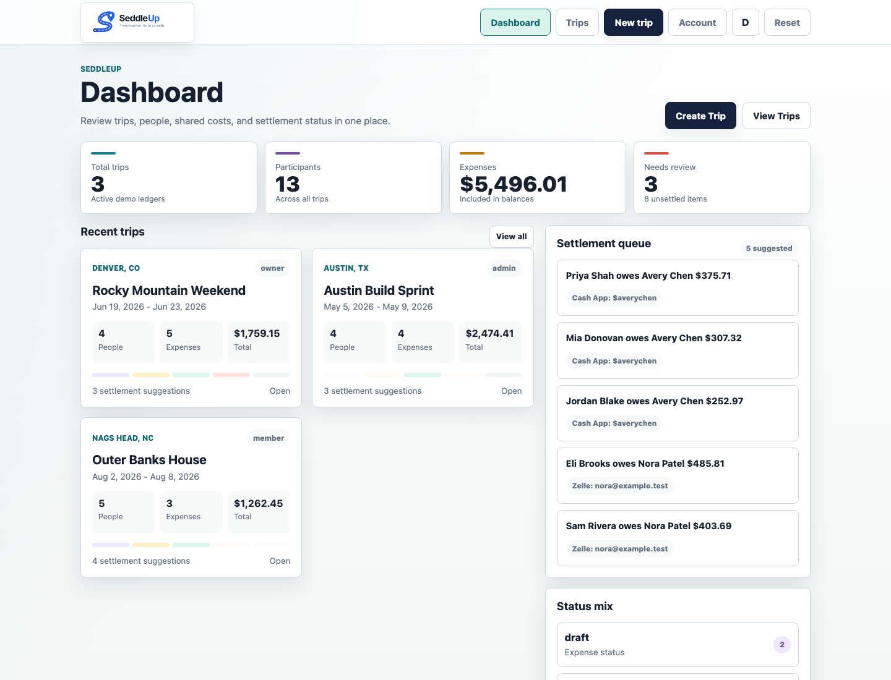
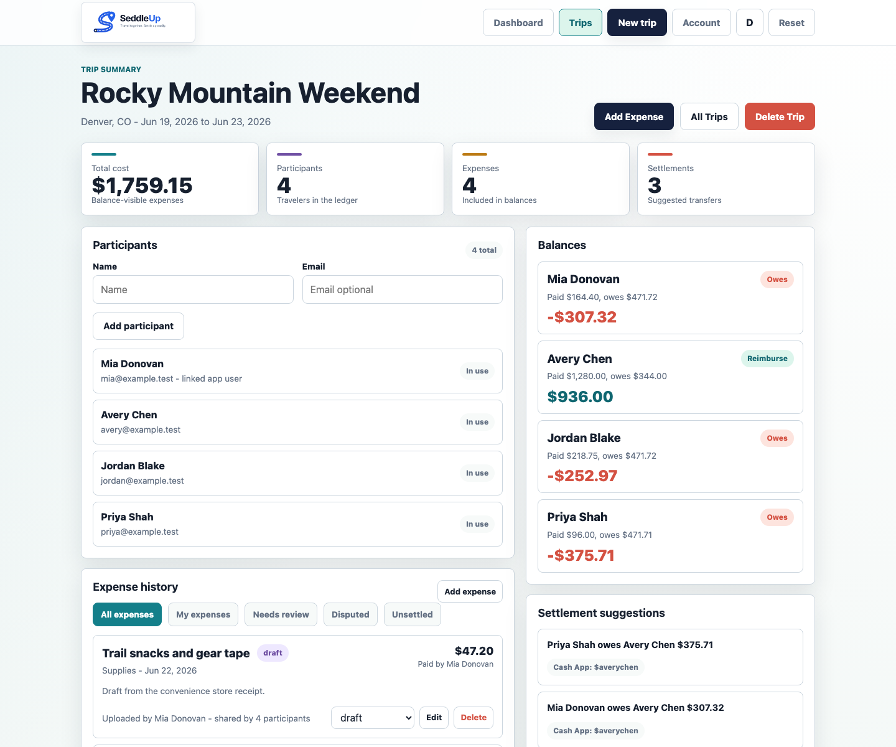

# SeddleUp

SeddleUp is a self-hosted web app for tracking shared travel costs. It gives a
group one clear trip ledger: who is going, who paid, which expenses count toward
the balance, and the simplest reimbursement suggestions for settling up.

## What It Does

- Tracks trips, participants, expenses, balances, and settlement suggestions.
- Lets trip managers create revocable, optionally expiring bearer links to a
  deliberately limited, read-only cost summary with privacy-filtered participant
  names.
- Supports collaborative trip memberships with owner, admin, member, and viewer
  roles.
- Lets members create expenses and move them through draft, submitted, disputed,
  approved, and settled states.
- Splits expenses across the right participants instead of assuming every cost
  belongs to everyone.
- Shows external payment links or handles for settlement convenience without
  processing payments or storing payment credentials.
- Stores receipt uploads locally, keeps receipt files outside public assets, and
  serves them only after trip membership checks.
- Provides a receipt parser and itemized receipt line item storage for review
  and correction.
- Includes an optional server-side retail item lookup abstraction with a mock
  provider for development and tests.
- Supports credentials login, email verification, password reset, invitations,
  email-code MFA, authenticator-app MFA, and OAuth login/account linking.
- Gives administrators user, auth provider, app setting, invitation, and audit
  log controls.
- Includes an optional Discord interactions endpoint for linked users.

## Screenshots

The dashboard shows the core trip, expense, review, and settlement flow at a glance.



Trip detail pages keep participants, expense history, balances, settlement suggestions, and activity in one ledger view.



More screenshots are available in the [Screenshots wiki page](https://github.com/cryptnetworks/seddleup/wiki/Screenshots).

## How The App Works

1. A user creates a trip and becomes the trip owner.
2. The owner or a trip admin adds participants. When a participant email matches
   an app user, that user is linked to the participant and added as a trip
   member. When the email does not match a user, SeddleUp creates a trip
   invitation.
3. Members add expenses as the trip happens. Each expense records who paid, who
   shared it, who created or updated it, and its current status.
4. Draft expenses stay private to the creator and trip managers. Submitted,
   disputed, approved, and settled expenses are visible to trip members and are
   included in balances.
5. SeddleUp calculates each participant's net position and suggests payments that
   settle the trip with fewer transfers.
6. Once an expense is marked settled, normal edits and deletes are locked so the
   trip ledger stays stable.
7. Admin and trip activity is written to audit logs, with trip context where
   practical.

## Runtime Model

SeddleUp is a Next.js App Router application backed by Prisma and SQLite. The
production Docker container starts as a non-root user, validates configuration,
generates Prisma Client, applies migrations, and starts the Next.js server.

The app is designed for single-container Docker deployments with SQLite stored
in a persistent volume at `/app/data`. PostgreSQL is not currently supported by
the schema or migrations.

Operational endpoints distinguish process liveness from application readiness:
`/api/health/live` confirms that the HTTP process is responding, while
`/api/health` verifies runtime configuration, database connectivity, and that
all bundled Prisma migrations are applied. Both responses expose only coarse
status values and are never cached.

Authentication uses NextAuth sessions plus app-level checks against the current
database user. One-time tokens for invitations, email verification, password
reset, and MFA handoff are stored as keyed digests. Stored OAuth provider client
secrets are encrypted with `AUTH_CONFIG_ENCRYPTION_KEY`.

Read-only trip sharing uses the same secret-backed keyed-digest pattern. Sharing
URLs are unlisted bearer credentials, not user accounts: anyone who receives a
link can view and forward its limited summary until it expires, is rotated, or is
revoked.

## Install And Operate

The published Docker image is:

```bash
docker pull ghcr.io/cryptnetworks/seddleup:latest
```

Follow the wiki installation guide for Docker setup, required environment
variables, persistent storage, health checks, and update steps:

- [Running with Docker](https://github.com/cryptnetworks/seddleup/wiki/Running-with-Docker)
- [Configuration](https://github.com/cryptnetworks/seddleup/wiki/Configuration)
- [Cloudflare Tunnel Deployment](https://github.com/cryptnetworks/seddleup/wiki/Cloudflare-Tunnel-Deployment)
- [Nginx and Let's Encrypt Deployment](https://github.com/cryptnetworks/seddleup/wiki/Nginx-and-Lets-Encrypt-Deployment)
- [Backups and Updates](https://github.com/cryptnetworks/seddleup/wiki/Backups-and-Updates)
- [Troubleshooting](https://github.com/cryptnetworks/seddleup/wiki/Troubleshooting)

Before the first production deployment, create a SQLite backup and rehearse the
restore validation steps. Before every update, record the deployed image digest
and keep a verified backup outside the application volume so both the image and
database can be rolled back.

The full documentation index is available in the
[SeddleUp wiki](https://github.com/cryptnetworks/seddleup/wiki).

## Search Discoverability

Set `PUBLIC_APP_URL` to the final HTTPS production origin before deployment, for
example `https://app.example.com`. SeddleUp uses that single origin for homepage
canonical metadata, social previews, structured data, `/robots.txt`, and
`/sitemap.xml`. Unsafe production values such as localhost or plain HTTP are not
published as canonical URLs.

Google and Bing ownership verification values are optional:

```env
GOOGLE_SITE_VERIFICATION=
BING_SITE_VERIFICATION=
```

After deployment:

1. Open `/robots.txt` and `/sitemap.xml` on the public origin and confirm that
   only the homepage is indexable.
2. Submit `/sitemap.xml` in Google Search Console and Bing Webmaster Tools.
3. Inspect the deployed homepage in each search console and a social-preview
   debugger to confirm its canonical URL, title, description, and image.

These SEO controls improve eligibility for organic discovery. Paid placement is
separate and requires a Google Ads or Microsoft Advertising account and campaign.

## Local Development

Use Node.js 24.18.0 LTS with npm 11.16.0.

```bash
npm install
cp .env.example .env
npm run prisma:generate
npm run prisma:migrate
npm run dev
```

Open `http://localhost:3000`.

## Quality Checks

Common local checks:

```bash
npm run validate:config
npx prisma validate
npm run format:check
npm run lint
npm run typecheck
npm test
npm run test:e2e
npm run test:e2e:production
npm run test:e2e:receipts
npm run build
npm run security:audit
```

Docker-impacting changes should also build the production image and run the
isolated runtime probes:

```bash
docker build -t seddleup:ci .
npm run test:docker
```

The probe creates temporary labeled Docker volumes and verifies fresh SQLite
migrations, health, restart idempotency, data preservation, legacy
`triptally.db` adoption, and explicit invalid, inaccessible, and failed-migration
startup errors. It removes its containers and volumes when it exits and never
uses an existing deployment volume.

See the wiki for more detail:

- [Architecture](https://github.com/cryptnetworks/seddleup/wiki/Architecture)
- [Security Model](https://github.com/cryptnetworks/seddleup/wiki/Security-Model)
- [Repository Automation](https://github.com/cryptnetworks/seddleup/wiki/Repository-Automation)
- [Testing and Production Readiness](https://github.com/cryptnetworks/seddleup/wiki/Testing-and-Production-Readiness)
- [Data Integrity Hardening](docs/data-integrity-hardening.md)
- [Contributing](https://github.com/cryptnetworks/seddleup/wiki/Contributing)

Report vulnerabilities privately. See [SECURITY.md](SECURITY.md).
